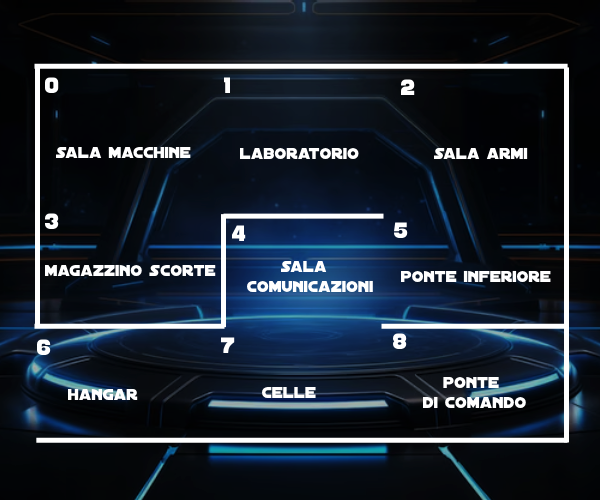

# Caso di studio - Metodi Avanzati di Programmazione 22-23
***NURJA Luan Abdurahman, REGGIO Francesco Maria, SANTOVITO Leonardo***

## Introduzione
Il caso di studio consiste nella realizzazione di una avventura testuale nel linguaggio Java, con l'obiettivo di applicare i concetti di programmazione orientata agli oggetti e di utilizzare gli argomenti spiegati durante il corso di Metodi Avanzati di Programmazione.

Il programma risultante è un gioco testuale, con interazione da linea di comando, in cui il giocatore impersona un personaggio che si trova in un mondo virtuale e deve interagire con esso per risolvere enigmi e proseguire nella storia.

## Descrizione generale del caso di studio
*Terra, anno 2030, la crisi energetica è la priorità di tutti i governi mondiali. Le discordie tra i paesi produttori di petrolio e le guerre rendono la situazione sempre più fuori controllo. L'Unione Europea si sta mobilitando per cercare una soluzione a questa crisi, allocando ingenti risorse nella ricerca e sviluppo di nuove fonti di energia rinnovabili. 
L'Agenzia Spaziale Europea (ESA) ricerca nello spazio nuove forme di energia e ha scoperto un pianeta potenzialmente abitabile, denominato 'Eden', situato ad una distanza incredibilmente vicina alla Terra. Viene organizzata una spedizione di due astronauti per esplorare il pianeta e cercare di capire se è possibile trasferirvi una cerchia di eletti.
Dieci anni dopo, lo shuttle è quasi giunto a destinazione...*

In **Starship Exodus**, il giocatore dovrà impersonare uno dei due astronauti della spedizione spaziale in arrivo verso 'Eden'. Sul pianeta, però, non ci metterà mai piede. Il giocatore si ritroverà improvvisamente in una astronave aliena, e utilizzare tutti i mezzi a propria disposizione per sopravvivere, con la speranza di tornare a casa.

La mappa del gioco è strutturata in stanze comunicanti, ognuna delle quali rappresenta un luogo all'interno dell'astronave aliena. All'interno delle stanze possono esserci degli oggetti che il giocatore potrebbe raccogliere e utilizzare per risolvere enigmi e sfide. Alcune stanze potrebbero essere bloccate e richiedere l'utilizzo di oggetti specifici per poter essere aperte.
Il giocatore può muoversi tra le stanze, esaminare oggetti, raccoglierli, usarli per risolvere enigmi e sfide per poter proseguire nella storia. L'obiettivo finale del gioco è trovare un modo di fuggire dall'astronave aliena e tornare a casa.

## Struttura del progetto

Il progetto è strutturato in package, ognuno dei quali contiene classi che implementano funzionalità specifiche del gioco. Di seguito è riportata la struttura del progetto:

